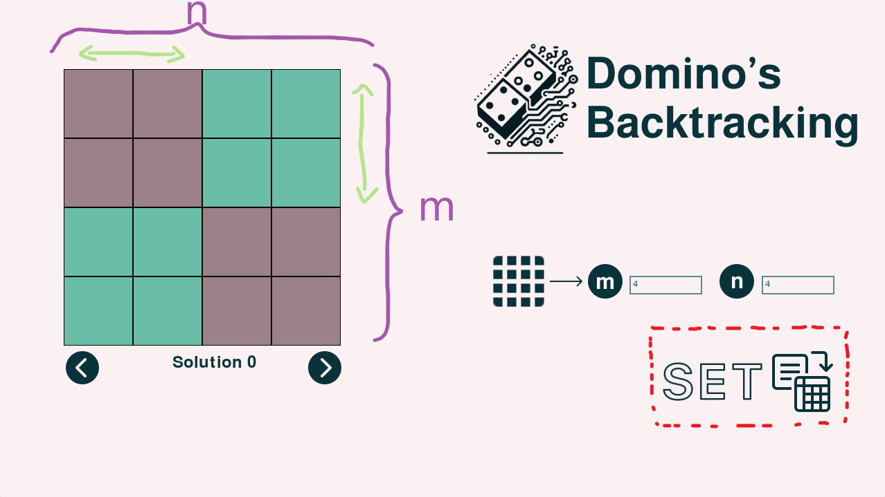

# Instrucciones de Inicio

Para ejecutar el programa, sigue estos pasos:

## Requisitos Previos

- Asegúrate de tener Python instalado en tu sistema.

## Instalación de Pygame

1. Abre tu terminal o línea de comandos.
2. Instala Pygame ejecutando el siguiente comando:

    ```
    pip install pygame
    ```


## Ejecución del Programa

Una vez instalado Python y Pygame, puedes ejecutar el programa de la siguiente manera:

1. Abre tu terminal o línea de comandos.
2. Navega hasta el directorio donde se encuentra el archivo `main.py`.
3. Ejecuta el siguiente comando:

    ```
    python main.py
    ```

Esto iniciará el programa.


# Modo de Uso



Las celdas oscuras indican la posición de una pieza horizontal, las celdas claras, una pieza vertical. M y N son las dimensiones del tablero, para ingresarlas hay que hacer click en el espacio demarcado, y luego de que ambas dimensiones tengan un número válido, se puede apretar el botón "Set" para dar comienzo al programa.
Las flechas abajo del tablero pueden ser utilizadas en cuanto las soluciones hayan sido encontradas, estas permiten moverse entre las soluciones. El número de la solución actual se muestra justo debajo de la solución.